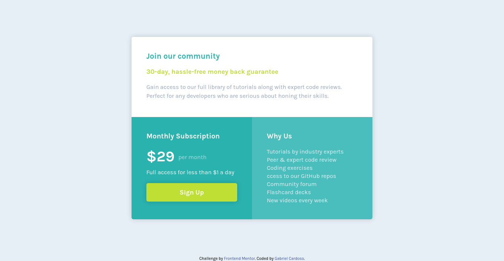

## Table of contents

- [Overview](#overview)
  - [The challenge](#the-challenge)
  - [Screenshot](#screenshot)
  - [Links](#links)
- [My process](#my-process)
  - [Built with](#built-with)
  - [What I learned](#what-i-learned)
- [Author](#author)

## Overview

### The challenge

Users should be able to:

- View the optimal layout for the component depending on their device's screen size
- See a hover state on desktop for the Sign Up call-to-action

### Screenshot




### Links

- Solution URL: https://www.frontendmentor.io/solutions/single-price-grid-component-T79ZWdJ0R
- Live Site URL: https://gabrielcardosodev.github.io/single-price-grid-component/

## My process

- I used grid in this challenge to get away from flexbox a bit and ended up being surprised by the ease that the display grid brings to us.

- I plan to use it more often in the next challenges.

### Built with

- Semantic HTML5 markup
- CSS custom properties
- CSS Grid
- Mobile-first workflow

### What I learned

```css
.top {
  grid-template-columns: 1fr 1fr;
  grid-area: 1 / 1 / 2 / 3;
}

.middle,
.bottom {
  grid-row: 2;
}
```

## Author

- Website - https://www.linkedin.com/in/gabrielcardosodev
- Frontend Mentor - https://www.frontendmentor.io/profile/gabrielcardosodev
- Twitter - https://www.twitter.com/cardjoso
